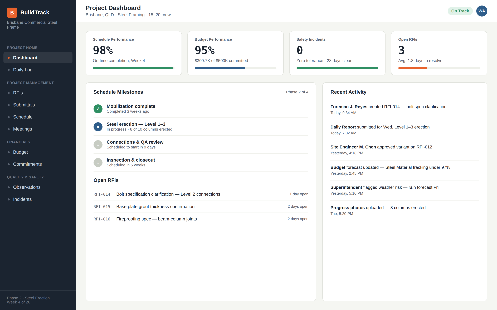
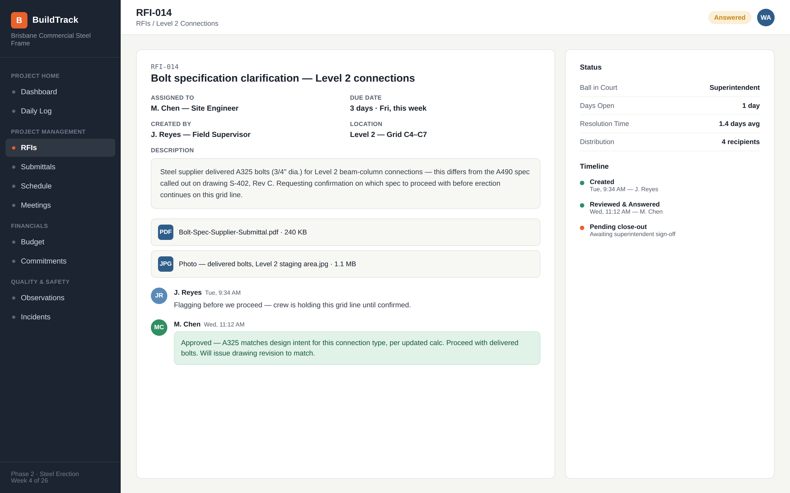
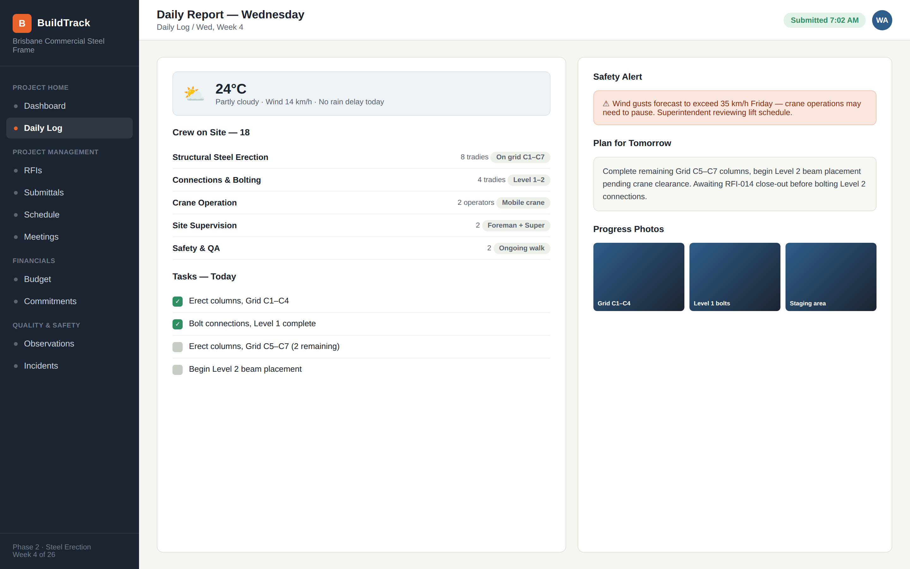
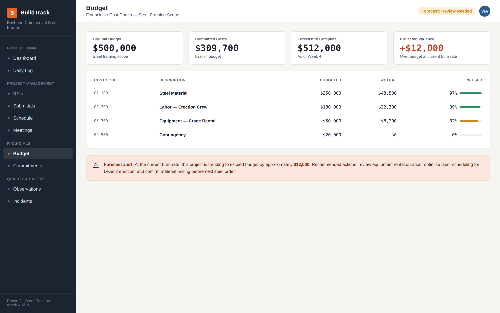

## Platform Mockups

> These are conceptual UI mockups built to illustrate the Procore workflows 
> described in this case study — not actual Procore product screenshots.

### 1. Project Dashboard
Real-time KPIs — schedule performance, budget status, safety, and open RFIs.

### 2. RFI Workflow — Bolt Specification Clarification
The bolt spec scenario from Section 3.3, showing the full RFI cycle from 
creation to approval.

### 3. Daily Report
Morning report covering weather, crew, tasks, and safety alerts — replacing 
scattered email/WhatsApp updates.

### 4. Budget Tracking
Cost code breakdown with real-time forecasting, flagging the $12,000 
projected overrun before it happens.

